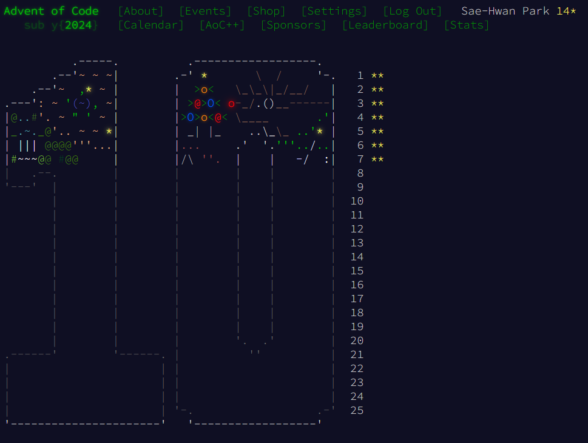

(Current status as of 26 July 2025...)

# Advent of Code 2024 Solutions

Rust solutions for [Advent of Code 2024](https://adventofcode.com/2024), featuring my own approaches and algorithms.

## 🚀 Quick Start

```bash
# Clone the repository
git clone <repo url>
cd aoc2024

# Run a specific day's solution
cargo run --example day01

# Run with release optimizations (possibly recommended for later days)
cargo run --release --example day01
```

## 📁 Project Structure

```
├── examples/          # Daily solution implementations
│   ├── day01.rs      # Day 1: Historian Hysteria
│   ├── day02.rs      # Day 2: Red-Nosed Reports
│   └── ...           # Days 3-25
├── input/            # Puzzle inputs and test cases
│   ├── d01_full.txt  # Full puzzle input
│   ├── d01_simple1.txt # Sample input for testing
│   └── ...
├── docs/             # Additional documentation
│   └── ...          # Extra discussion or explanation
└── src/
    └── main.rs       # Entry point (unchanged)
```

## 🎯 Solutions Overview

Each day's solution is implemented as a standalone example in the `examples/` directory. I attempted to achieve:

- **Readability**: Clear, well-documented code
- **Performance**: Efficient algorithms and data structures
- **Rust idioms**: Leveraging Rust's type system and memory safety

## 📊 Running Solutions

### Individual Days
```bash
# Run day N solution
cargo run --example dayXX

# With release optimizations
cargo run --release --example dayXX
```

### Input Files
Solutions automatically read from corresponding input files:
- `input/dXX_full.txt` -- Full puzzle input
- `input/dXX_simple*.txt` -- Sample inputs for testing

## 🛠️ Development

### Code Style
This project uses consistent formatting via `rustfmt.toml`:
```bash
cargo fmt
```

### Testing
Each solution includes validation against sample inputs to ensure correctness before running on full puzzle data.

## 📈 Performance Notes

Most solutions run in milliseconds, with a few exceptions:
- Later days (e.g., Day 23) may require `--release` flag for optimal performance
- Day 25's randomized algorithm may need multiple runs for consistency

## 🔗 Resources

- [Advent of Code 2024](https://adventofcode.com/2024)
- [Rust Documentation](https://doc.rust-lang.org/)

---

*Happy coding! 🎄*
